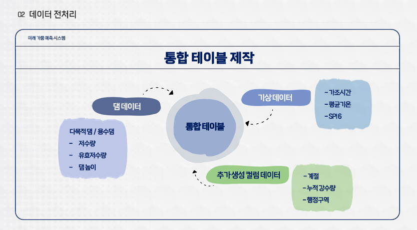
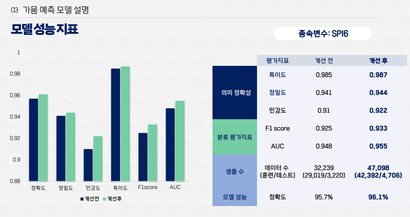
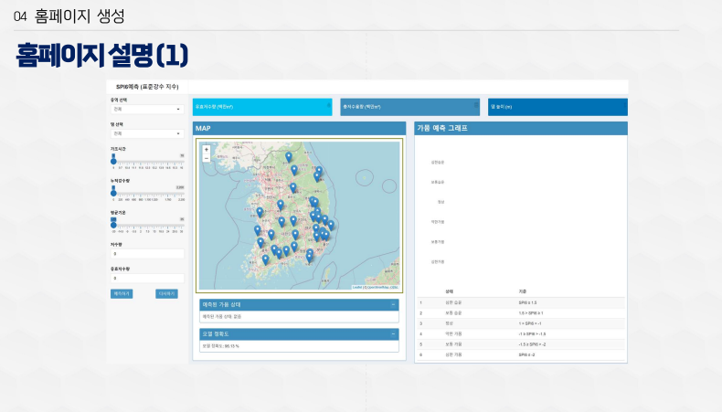
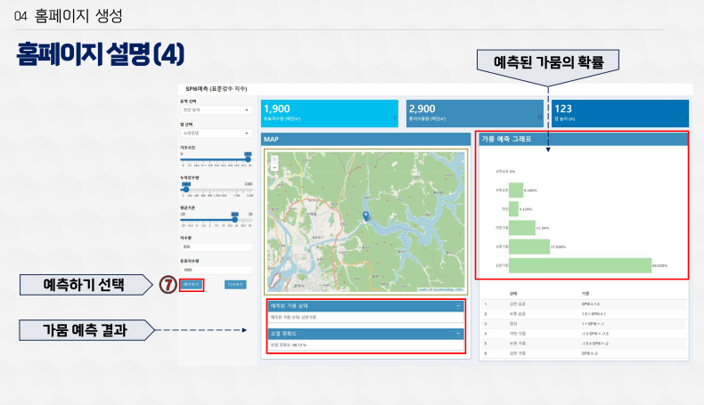

# 🌟 수자원 공모전 Project : SPI6를 활용한 미래 가뭄 예측 시스템

### 프로젝트 발표 자료
- 프로젝트의 전체 내용은 아래 PDF 파일에서 확인할 수 있습니다. 
 
  👉 [발표 자료 다운로드 - pdf](https://github.com/Kim-Jun-Hee/project2/blob/main/수자원공모전포트폴리오.pdf)  
  
📥 **다운로드 안내**  
💡 **PDF**: 오른쪽 상단의 다운로드 버튼을 누르면 다운로드가 가능합니다.
  

### 공모전 제출 파일
---

**🌟 프로젝트에 대한 상세 내용이 들어있는 파일입니다.**

[**공모전 제출 파일 자료 다운로드**](https://github.com/Kim-Jun-Hee/project2/blob/main/제출파일.pdf)

---
  

### 📂 프로젝트 목표
- 대한민국의 현재 물 자원 상황 분석
- 기상학적 및 수문학적 요소를 결합한 가뭄 예측 모델 개발
- SPI6 기반 가뭄 예측 조기 경보 시스템 구축
  

### 📅 프로젝트 기간
- 2024.06.24 ~ 2024.07.18
  

### 프로젝트 인원 및 역할
- 총인원: 5명
- 개인 작업: 기상 데이터 전처리,모델 평가 지표 시각화
- 공동 작업: 가뭄 예측 모델 구현,모델 성능 높이기
  

### 사용된 기술 및 도구

#### 💻 주요 기술
 **SQL**
  **R** (shiny,randomForest,plotly..)

#### 🛠️ 도구 

  
  
  
  

  

### 🌐 가뭄 예측 홈페이지 링크
---

[🔗 **가뭄 예측 홈페이지 바로가기**](https://spi-predictor.shinyapps.io/spi100/)

⚠️ **주의사항**  
서번 연결이 끊긴 경우, **새로고침**을 몇 번 시도하면 정상적으로 접속됩니다.

---
  

### 🏆 주요 결과물
<table>
  <tr>
    <td align="center">🌟 기상학적 및 수문학적 요소 결합</td>
    <td align="center">🌟 가뭄 예측 모델 성능 향상</td>
  </tr>
  <tr>
    <td>
      
    </td>
    <td>
      
    </td>
  </tr>
  <tr>
    <td align="center">🌟 가뭄 예측 홈페이지 - 시작 화면</td>
    <td align="center">🌟 가뭄 예측 홈페이지 - 결과 화면</td>
  </tr>
  <tr>
    <td>
      
    </td>
    <td>
      
    </td>
  </tr>
</table>

